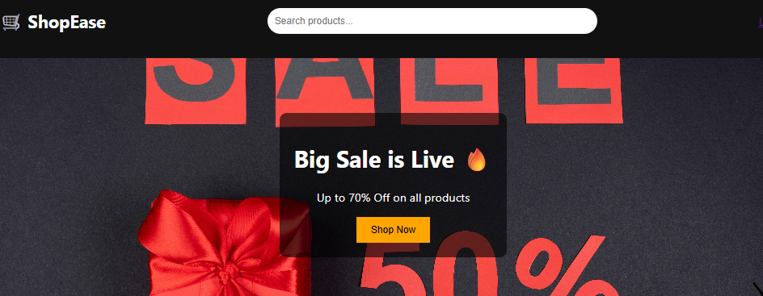
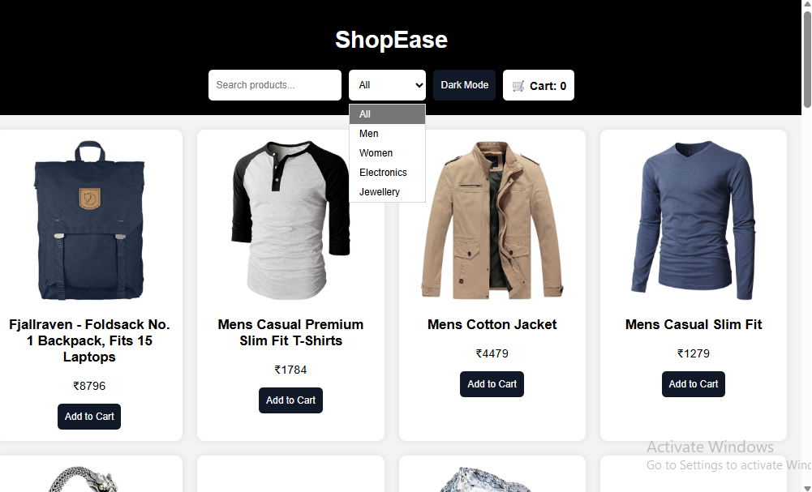
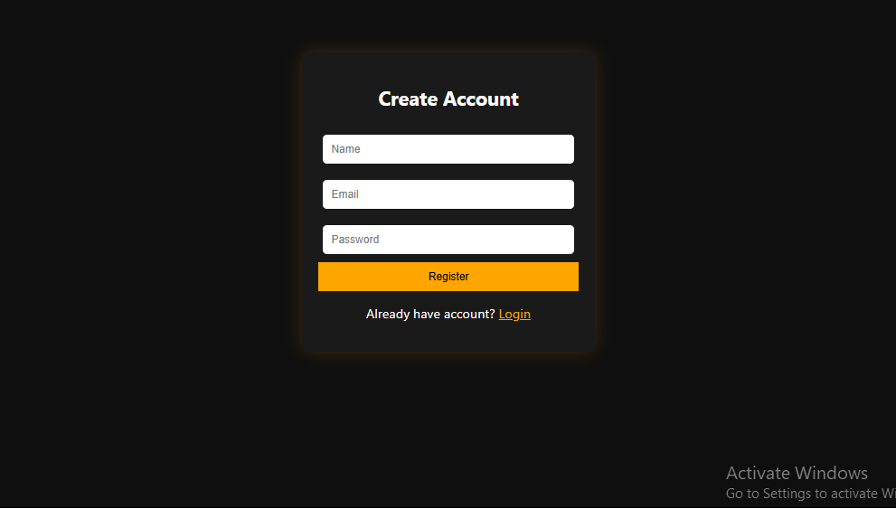

# 🛒 E-Commerce Website

A fully responsive eCommerce website built using HTML, CSS, JavaScript, Node.js, Express.js, and MongoDB.

---

## 🚀 Features

- User Registration & Login
- Product Listings
- Search Functionality
- Shopping Cart
- Order Placement
- Responsive Design
- Admin Panel
- MongoDB Database Integration

---

## 🛠️ Technologies Used

### Frontend
- HTML
- CSS
- JavaScript

### Backend
- Node.js
- Express.js

### Database
- MongoDB

# 🛒 E-Commerce Website

## Home Page

## Products Page

## register Page
 
